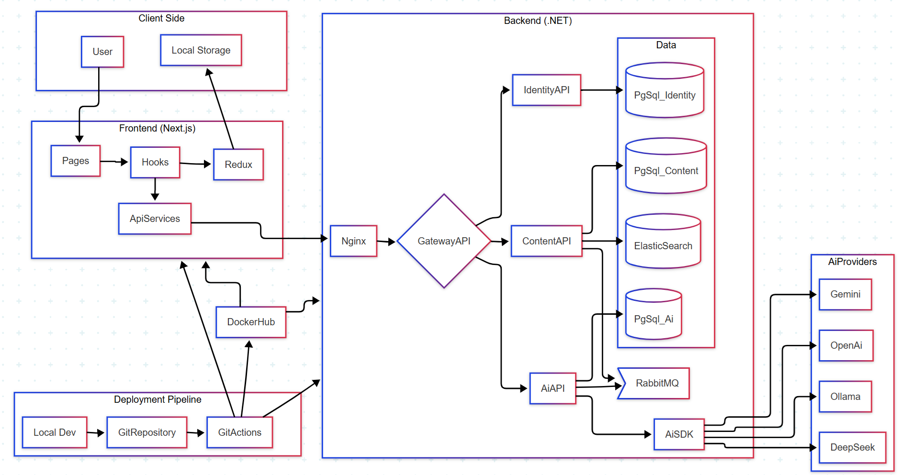
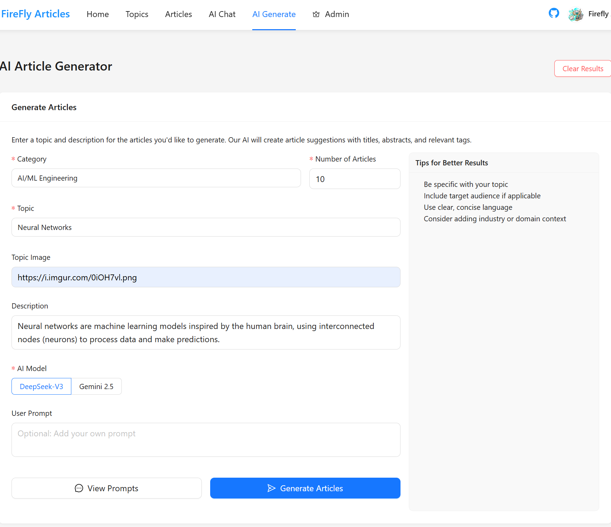
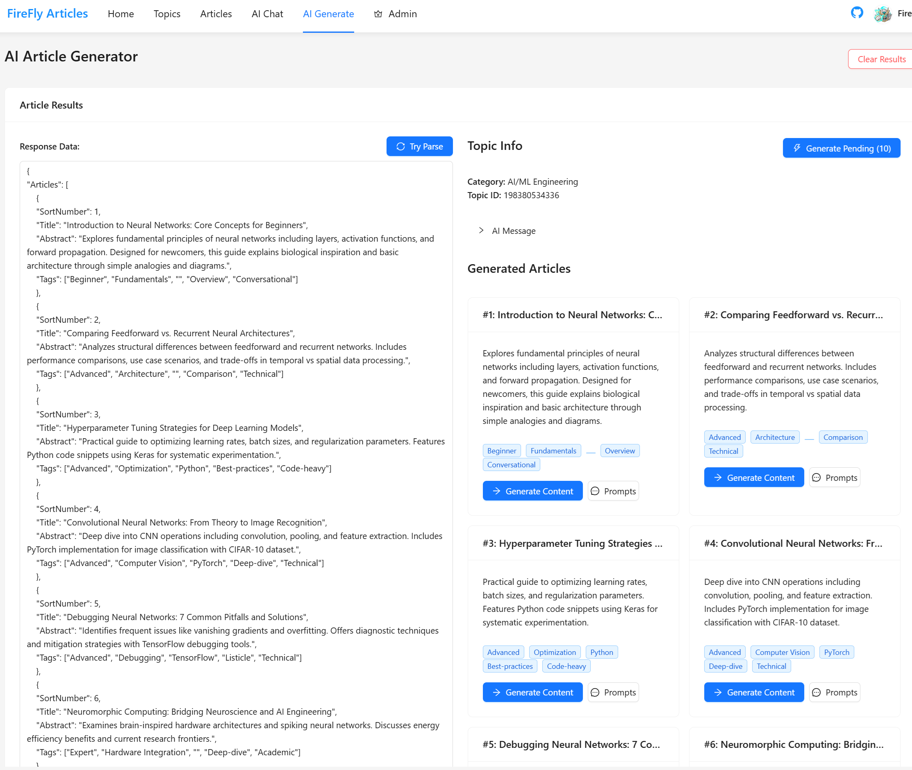
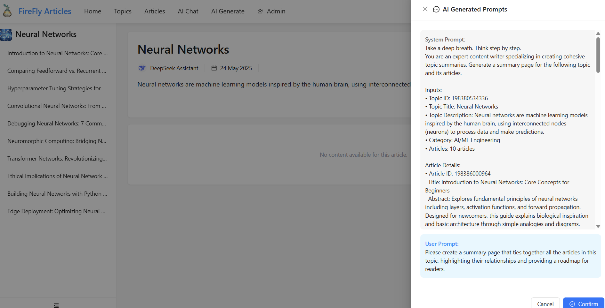

# Firefly Articles: AI-Powered Content Generation

## Overview

Firefly Articles is a web application designed to streamline content creation using the power of Artificial Intelligence. 

## Features

* **AI-Powered Article Generation:** Automatically create multiple articles based on your specified inputs.
* **Intuitive Interface:** Easy-to-use web interface for viewing, searching and generating articles.
* **Article Search:** Search articles using category/topic/tags or keywords.
* **Content Review & Editing:** Review and further refine or regenerate the AI-generated content.
* **AI Chat:** Ahat with a varity of AIs and manage chat history

## Technology Stack

* **Frontend:** 
    - Next.js SSR
    - Redux & Redux Persist
* **Backend:** 
    - .Net
    - RabbitMQ
    - EF Core
    - Microservices Architecture
    - RESTful API
    - AI Integration
* **Database:** 
    - PostgreSQL
    - Elastic Search
    - Redis

* **DevOps:** 
    - GitActions CICD
    - Docker

## Getting Started

Todo

## Screenshots
Inputs to generate article list

Ai response. Users can edit raw json to modify prompts.

Generate topic summary page.

